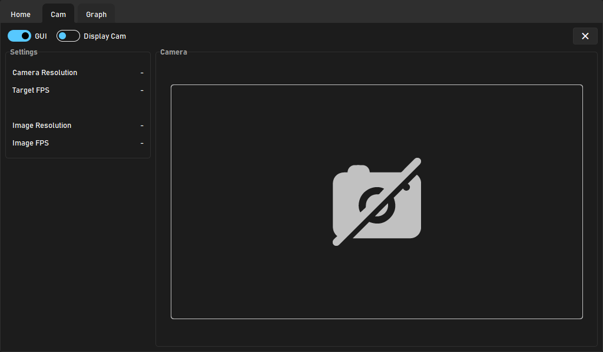

# DC Brushless DC Motor with Computer Vision

  
Table of Contents

  <ol>
    <li><a href="#about-the-project">About The Project</a></li>
    <li><a href="#how-to-control">How to Control</a></li>
    <li><a href="#tkinter-gui">TkInter GUI</a></li>
  </ol>

## About The Project
This project aims to produce a system capable of controlling the vehicle with computer vision using behavioural cloning AI, to recognise roads and autonomously run on them.

(<a href="#readme-top">back to top</a>)

# How to Control
The project uses a Logitech F710 controller to control the vehicle. The key mappings are shown below on the table. The Key ID is derived using a Python Package called [Inputs](https://inputs.readthedocs.io/en/latest/).

| Controls             	| Key ID         	| Key          	|
|----------------------	|----------------	|--------------	|
| Enable Control Loop  	| BTN_START      	| Start        	|
| Disconnect           	| BTN_BACK       	| Back         	|
| Motor Forward        	| ABS_HAY0Y_-1   	| Up           	|
| Motor Backwards      	| ABS_HAY0Y_1    	| Down         	|
| Steer Left           	| ABS_HAY0X_-1   	| Left         	|
| Steer Right          	| ABS_HAY0X_1    	| Right        	|
| Steer Calibration    	| BTN_NORTH      	| Y            	|
| Steer to Center      	| BTN_SOUTH      	| A            	|
| Motor Stop           	| BTN_EAST       	| B            	|
| Motor Calibration    	| BTN_WEST       	| X            	|
| Start Training       	| BTN_TL         	| Left Bumper  	|
| Stop Training        	| BTN_TR         	| Right Bumper 	|
| Enable Motor Control 	| ABS_Z & ABS_RZ 	| Triggers     	|

(<a href="#readme-top">back to top</a>)

# GUI
A mounted mini display on the vehicle will display the GUI. It will show the statistics of the vehicle's systems and components. The project is using [TkInter](https://docs.python.org/3/library/tk.html) GUI Framework, which is built into the Python Standard Library. Hence, no additional Packages is needed to be installed. [TkInter](https://docs.python.org/3/library/tk.html) is the easiet to learn and program in Python, making it easy to integrate into the Raspberry Pi along with the other programs.

In addition, the TkInter use a theme called [Sun-Valley TTK](https://github.com/rdbende/Sun-Valley-ttk-theme) which gives this modern look.

## GUI Features
- Reactive Control Buttons
- Camera Display
- Temperature Graph Diplay
- Live Data Display

(<a href="#readme-top">back to top</a>)

